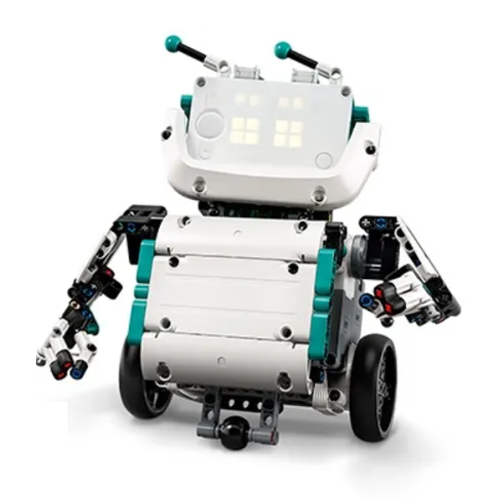
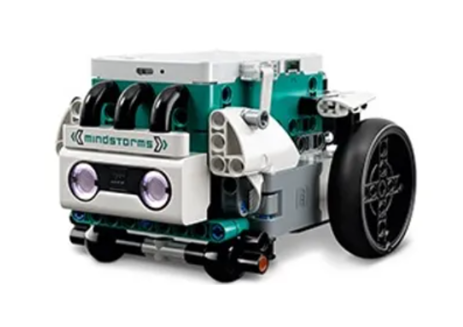
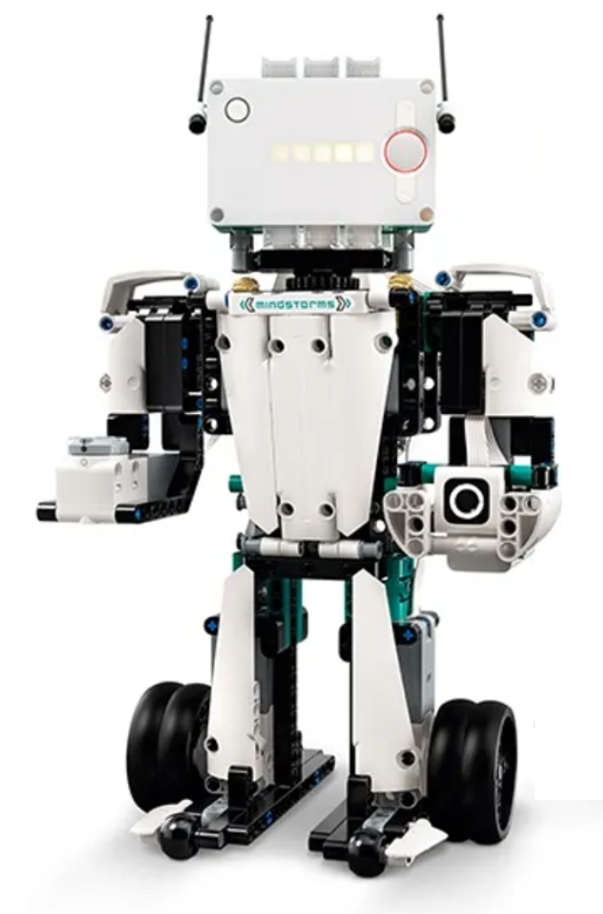
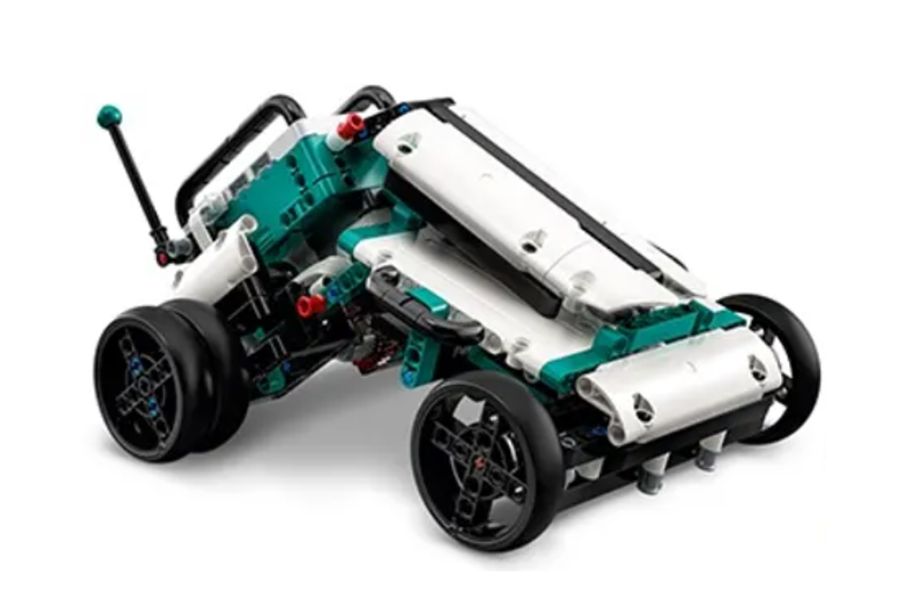
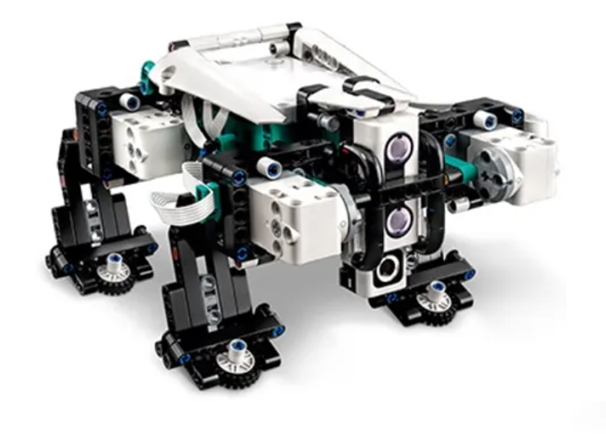

  

# Base Projects
The [LEGO Mindstorms 51515 software](https://www.microsoft.com/en-us/p/lego-mindstorms-robot-inventor/9mtq0n7w1d6x) already comes with several programs for the different robots. However, these are all programmed using Scratch. In this directory you will find their counterparts in (Micro)Python.

* ## **[Charlie](https://github.com/arturomoncadatorres/lego-mindstorms/tree/main/base/charlie)** 

  

-------

* ## **[Tricky](https://github.com/arturomoncadatorres/lego-mindstorms/tree/main/base/tricky)** 

  

-------

* ## **[Blast](https://github.com/arturomoncadatorres/lego-mindstorms/tree/main/base/blast)** 

  

-------

* ## **[MVP](https://github.com/arturomoncadatorres/lego-mindstorms/tree/main/base/mvp)** 

  

-------

* ## **[Gelo](https://github.com/arturomoncadatorres/lego-mindstorms/tree/main/base/gelo)** 

  

-------

**Note**: I started working on these scripts as a learning exercise. At the same time, I am hoping that they will be useful to people giving their first steps in (Micro)Python for LEGO. However, it was [recently pointed out to me](https://www.eurobricks.com/forum/index.php?/forums/topic/181689-some-python-for-51515/&do=findComment&comment=3337915) that you could just download the Scratch programs into the hub and upload them back into the computer as Python scripts using something like [`rshell`](https://github.com/dhylands/rshell). I guess that could also be an option. I might try something like that in the future. On the meantime, I'm quite happy working with the vanilla (Micro)Python version that is included. If you try it, let me know!
