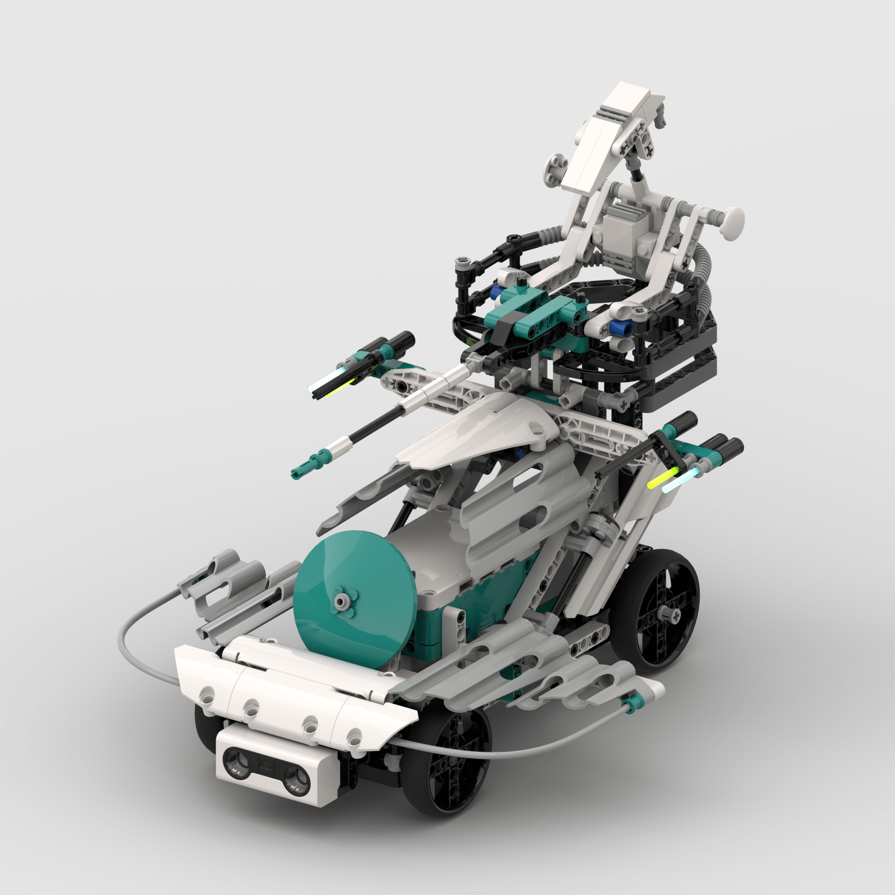
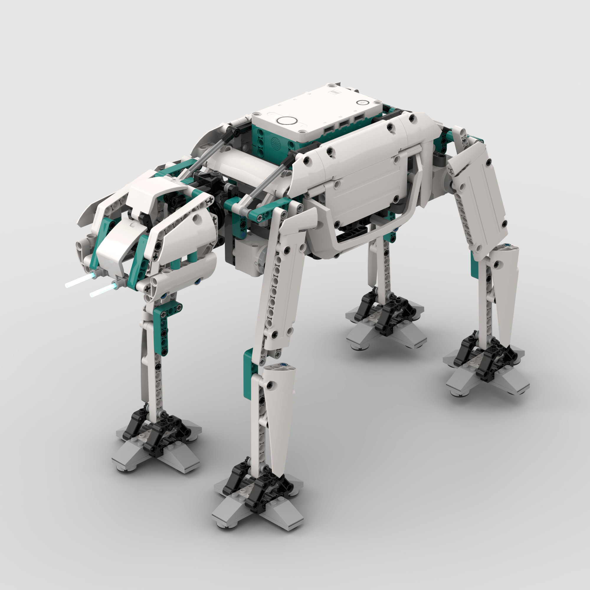
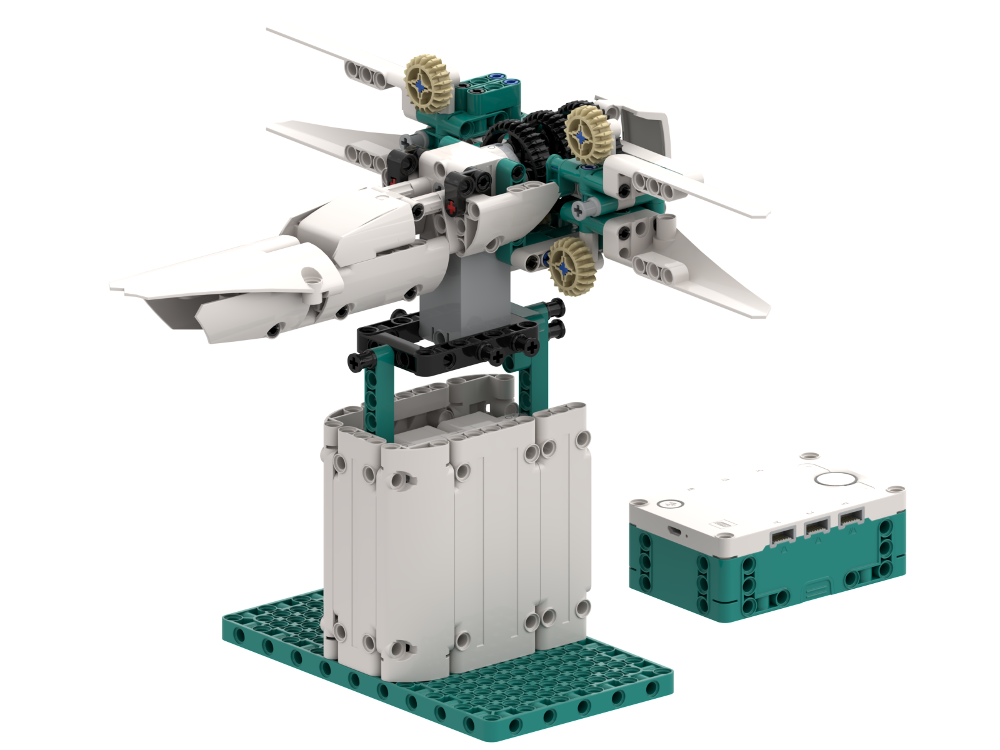
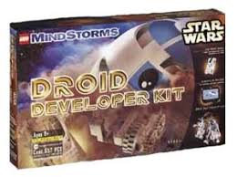
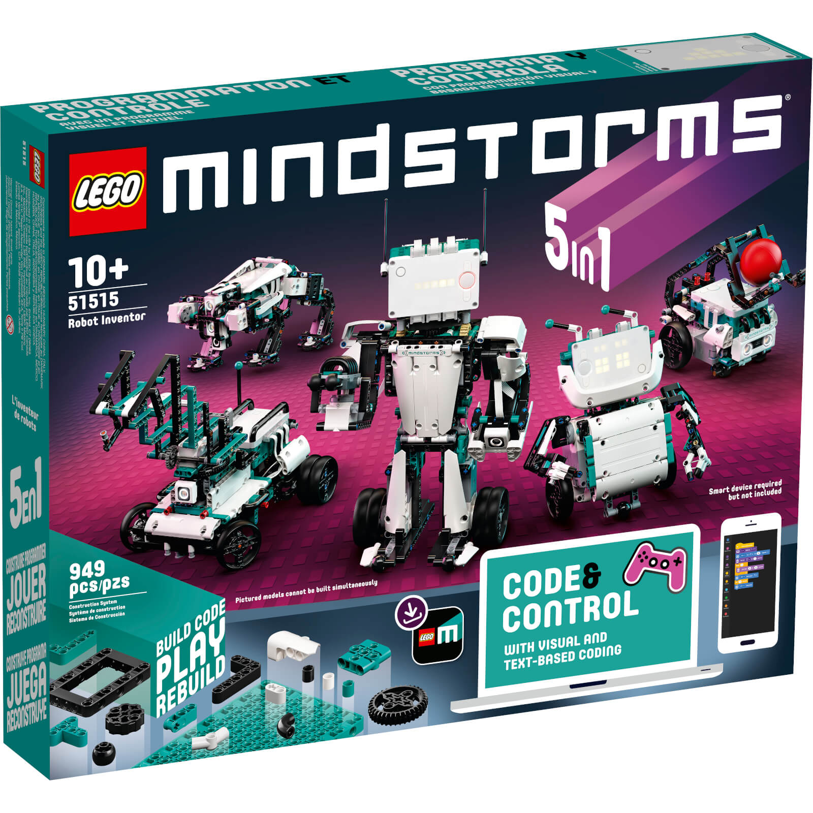
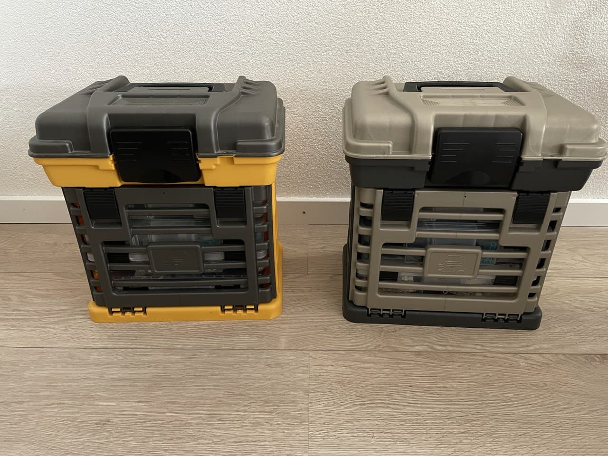
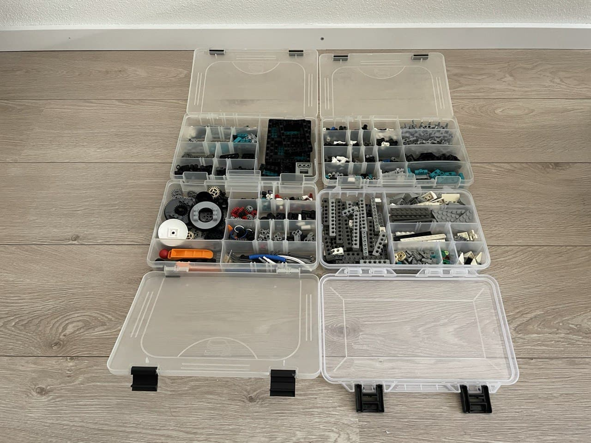

  

# MOCs
Here, I've documented my own creations (MOCs). For each of them, I've included the building instructions for the robot (as a PDF), as well as its corresponding (Python) program, so that anyone can reproduce them and, most importantly, *build* upon them!

  <a href="#projects">Projects</a> •
  <a href="#base-sets">Base sets</a> •
  <a href="#my-storage-solution">My storage solution</a> •
  <a href="#creating-instructions">Creating instructions</a>

------

## Projects

* ## **[AAT MS5](https://github.com/arturomoncadatorres/lego-mindstorms/tree/main/mocs/aat_ms5)** 

<table><tr>
<td>

Armored Assault Tank using the MINDSTORMS 51515 set, or **AAT MS5** in short. It is inspired by the [Battle Droid on STAP](https://arturomoncadatorres.com/battle-droid-stap/) of the Droid Developer Kit and the [AAT](https://arturomoncadatorres.com/aat/) of the Dark Side Developer Kit.

</td>
<td>  </td>
</tr>
</table>

* ## **[AT-AT MS5](https://github.com/arturomoncadatorres/lego-mindstorms/tree/main/mocs/atat_ms5)** 

<table><tr>
<td>

All Terrain Armored Transport using the MINDSTORMS 51515 set, or **AT-AT MS5** in short. It is a reimagining of the AT-AT build of the Dark Side Developer Kit (released on 2000 - long time ago).

</td>
<td>  </td>
</tr>
</table>

* ## **[AT-AT MS5](https://github.com/arturomoncadatorres/lego-mindstorms/tree/main/mocs/xwing_ms5)** 

<table><tr>
<td>

An X-wing Starfighter using the MINDSTORMS 51515 set, or **X-wing MS5** in short. It is inspired by the EV3 version by [LEGORobotics Mr. Hino](https://www.youtube.com/watch?v=9LORehcdxRA&). 

</td>
<td>  </td>
</tr>
</table>

-------

## Base sets
My LEGO MINDSTORMS collection is composed of 4 different sets:

<table>
<tr>
<td>

#### The 2006 MINDSTORMS **[(8527)](https://www.bricklink.com/v2/catalog/catalogitem.page?S=8527-1)**

</td>
<td>  </td>
</tr>
<tr>
<td>

#### The Droid Developer Kit **[(9748)](https://www.bricklink.com/v2/catalog/catalogitem.page?S=9748-1)**

</td>
<td>  </td>
</tr>
<tr>
<td>

#### The Dark Side Developer Kit **[(9754)](https://www.bricklink.com/v2/catalog/catalogitem.page?S=9754-1)**

</td>
<td>  </td>
</tr>
<tr>
<td>

#### The 2020 MINDSTORMS **[(51515)](https://www.lego.com/en-us/product/robot-inventor-51515)**

</td>
<td>  </td>
</tr>
</table>

While the rest of this repository is focused on the last set, there is a chance that the models that you will find here use pieces from these other sets as well. Don't worry: at the end of the instructions of each model, you will find the bill of materials. This should allow you to get the missing pieces separately (for which I recommend [Bricklink](https://www.bricklink.com/v2/main.page), although there are many other marketplaces where you can probably get them as well).

If any project uses pieces from any other set, it will be mentioned explicitly in its description.

-------

## My storage solution
Having my LEGO pieces in order and easy to access makes a huge difference in making my building process enjoyable. I have organized all my stuff using two [Plano Molding boxes](https://www.planomolding.com/medium-rack-organizer).

<table><tr>
<td>  </td>
<td>  </td>
</tr>
</table>

They measure 32 x 22 x 36 cm, which makes them spacious enough to fit all your stuff, but still very easy to handle. The top part of each container is great to store the hub, motors, sensors, and very big elements (like the Duplo balls). Moreover, the individual boxes are perfect for storing the small pieces. Very importantly, they come with adjustable compartments, so you can make your own divisions as you prefer:

<table><tr>
<td>  </td>
<td>  </td>
<td>  </td>
</tr>
</table>

Consider that I use two boxes to store the elements of all 4 sets. However, if you are starting with, let's say, the 51515 set only, my guess is that one box should be enough. Because of the variety of LEGO elements, I would probably go for the one with 4 shallow boxes (i.e., the yellow one), rather than the one with 1 shallow and 2 deep boxes (i.e., the brown one).

You can easily find them in [Amazon](https://www.amazon.nl/gp/product/B001TH8P1E/ref=ppx_yo_dt_b_asin_title_o08_s00?ie=UTF8&psc=1). However, be careful with the dimensions: there are a couple of smaller alternatives. Unfortunately, you cannot tell the difference from the pictures only, so always check the specifications.

-------

## Creating instructions
WIP
