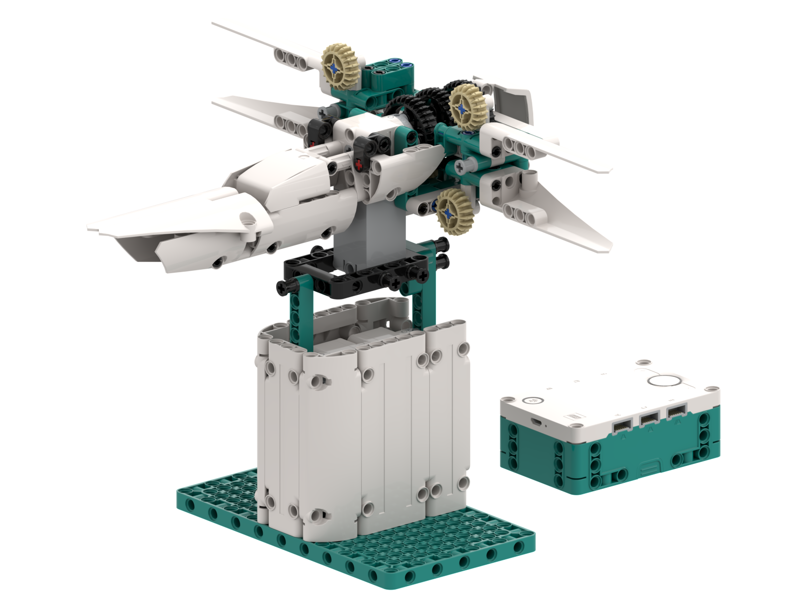

  

# X-Wing MS5
<table><tr>
<td>

In celebration of 2023's May the 4th, I have created an X-Wing Starfighter using the MINDSTORMS 51515 set, or **X-Wing MS5** in short. Not only is this one of the most iconic Star Wars ships, but it also aligns nicely with this year's release of the [X-Wing UCS set](https://www.lego.com/us-en/product/x-wing-starfighter-75355).

The ship will angle along the z-axis depending on the hub's orientation. It also allows switching [between cruise and attack mode](https://scifi.stackexchange.com/questions/6001/why-do-x-wings-change-wing-configuration). While in the latter, the X-Wing can fire its laser cannons.

Please note that this isn't an original idea. The first version concept that I saw of it was that by [LEGORobotics Mr. Hino](https://www.youtube.com/watch?v=9LORehcdxRA&) using the EV3 kit. Mr. Hino used a motor as a joystick to control the angle. However, I haven't seen an implementation using the Robot Inventor (51515) set or using an accelerometer to control the ship..

You can read more about this build and, most importantly, find the building instructions [here](https://arturomoncadatorres.com/xwing-ms5/).

I've included the program in two different ways:
* You can find the [`.py` script here](https://github.com/arturomoncadatorres/lego-mindstorms/blob/main/mocs/xwing_ms5/programs/xwing_ms5.py). This is the code that you would need to get the AAT MS5 up and running. To do so, just copy and paste the content of the script in a new MINDSTORMS Python project and you will be good to go.
* If you want to read and understand what the program is doing, I recommend you take a look at the corresponding [Jupyter notebook here](https://nbviewer.jupyter.org/github/arturomoncadatorres/lego-mindstorms/blob/main/mocs/xwing_ms5/programs/xwing_ms5.ipynb?flush_cache=True). I especially encourage you to go through the notebook if you are interested in the technical details of the motor control.

</td>
<td>  </td>
</tr>
</table>

The best part: seeing the whole thing in action!

  

  

(I'm still editing a video showcasing the functionality. On the meantime, I think that these GIFs should give you a good idea of how the robot works.)

-------------
