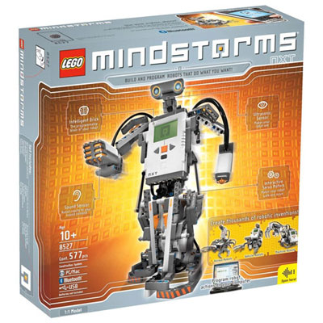
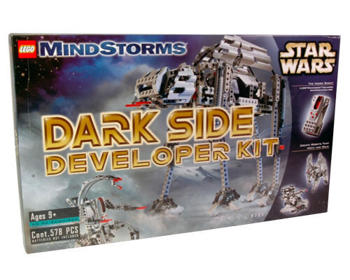

  

# Original Projects
Here, I've documented my own creations. For each of them, I've included the building instructions for the robot (as a PDF), as well as its corresponding (Python) program, so that anyone can reproduce them and, most importantly, *build* upon them!

## The Sets
My LEGO Mindstorms collection is composed of 4 different sets:

* #### The 2006 Mindstorms **[(8527)](https://www.bricklink.com/v2/catalog/catalogitem.page?S=8527-1)** 

  

* #### The Droid Developer Kit **[(9748)](https://www.bricklink.com/v2/catalog/catalogitem.page?S=9748-1)** 

  

* #### The Dark Side Developer Kit **[(9754)](https://www.bricklink.com/v2/catalog/catalogitem.page?S=9754-1)** 

  

* #### The 2020 Mindstorms **[(51515)](https://www.lego.com/en-us/product/robot-inventor-51515)** 

  

While the rest of this repository is focused on the last set, there is a chance that the models that you will find here use pieces from these other sets as well. Don't worry: at the end of the instructions of each model, you will find the bill of materials. This should allow you to get the missing pieces separately (for which I recommend [Bricklink](https://www.bricklink.com/v2/main.page), although there are many other marketplaces where you can probably get them as well).

If any project uses pieces from any other set, it will be mentioned explicitly in its description.

## The Storage
WIP

## The instructions
WIP
